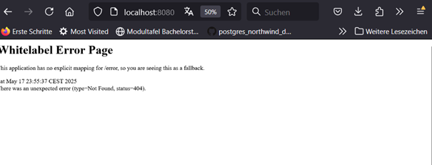
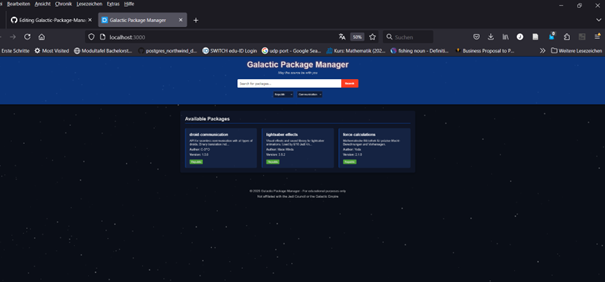
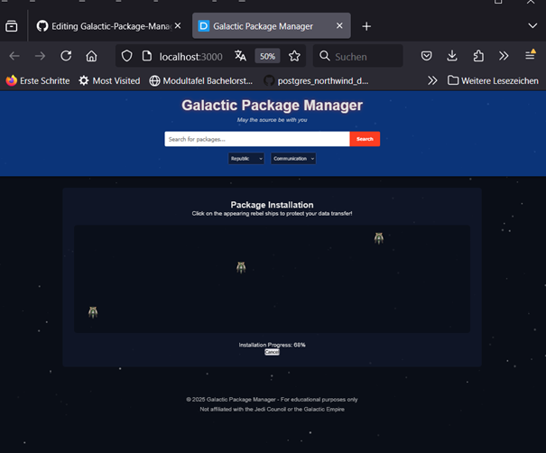
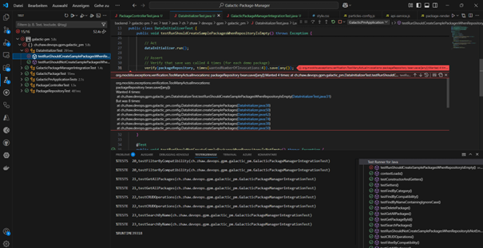
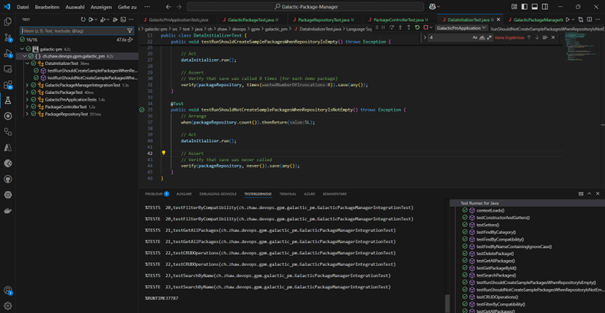
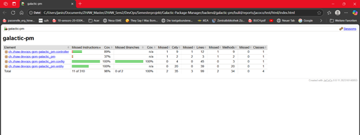
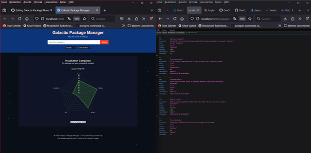

# Galactic Package Manager (GPM)

## Lernjournal: Implementierung einer Full-Stack DevOps-Anwendung

Dieses Lernjournal dokumentiert die Entwicklung des Galactic Package Managers (GPM), einer Full-Stack-Anwendung mit Spring Boot Backend und JavaScript Frontend. Das Projekt simuliert einen fiktiven Paketmanager für Weltraumtechnologien im Star Wars-Universum - quasi npm/Gradle für die Galaxis.

## Inhaltsverzeichnis

1. [Projektübersicht](#projektübersicht)
2. [Technologiestack](#technologiestack)
3. [Projektstruktur einrichten](#projektstruktur-einrichten)
4. [Backend implementieren](#backend-implementieren)
5. [Frontend entwickeln](#frontend-entwickeln)
6. [Integration und Tests](#integration-und-tests)
7. [JaCoCo-Testabdeckungsbericht](#jacoco-testabdeckungsbericht)

## Projektübersicht

Der Galactic Package Manager (GPM) ermöglicht Benutzern:
- Durchsuchen verfügbarer galaktischer Technologie-Pakete
- Anzeigen von Paketdetails und Bewertungen
- "Installation" von Paketen durch ein unterhaltsames Mini-Game
- Kompatibilitätsprüfung mit verschiedenen galaktischen Fraktionen

## Technologiestack

**Backend:**
- Spring Boot 3.x
- Java 21
- Gradle
- In-Memory Datenbank (für einfache Demonstration)

**Frontend:**
- HTML, CSS, JavaScript
- particles.js (für animierten Sternenhintergrund)
- chart.js (für Visualisierungen)
- anime.js (für Animationseffekte)

## Projektstruktur einrichten

### Schritt 1: Repository initialisieren

Dies wurde in Github manuell durchgeführt. 

### Schritt 2: Gradle-Projekt mit Spring Boot initialisieren

Es wurde Ctrl+Shift+P: "Spring Initializr: Create a Gradle Project...")
- Springboot-Version: 3.3.11
-java
- ch.zhaw.devops.gpm
- Artefakt ID: galactic-pm
- Jar
- Java Version 21

### Schritt 2: Gradle-Projekt mit Spring Boot initialisieren

Für die Erstellung des Spring Boot-Projekts wurde Visual Studio Code mit der Spring Boot Extension genutzt. Durch Drücken von `Ctrl+Shift+P` und Auswahl von "Spring Initializr: Create a Gradle Project..." öffnet sich der Projekt-Wizard, in dem folgende Parameter konfiguriert wurden:

- **Spring Boot Version:** 3.3.11 
- **Programmiersprache:** Java
- **Group ID:** ch.zhaw.devops.gpm (eindeutige Paket-Identifier im Maven-Format)
- **Artifact ID:** galactic-pm (Name des Projekts/der kompilierten Anwendung)
- **Packaging Type:** JAR (ausführbare Java-Anwendung)
- **Abhängigkeiten:** Spring Web (REST-API-Unterstützung)

Nach Bestätigung dieser Einstellungen (und der Auswahl des Backend-Ordners) generiert Spring Initializr automatisch die Grundstruktur des Projekts inklusive der erforderlichen Gradle-Konfiguration und Verzeichnisstruktur. Die resultierende `build.gradle`-Datei enthält bereits alle notwendigen Abhängigkeiten und Plugins für die Entwicklung der Galactic Package Manager-Backend-Komponente.

### Schritt 3: Projektstruktur für Monorepo einrichten

 Frontend-Teil einrichten:

1. In das `frontend`-Verzeichnis wechseln:
   ```bash
   cd frontend
   ```

2. Ein npm-Projekt initialisieren:
   ```bash
   npm init -y
   ```

3. Die benötigten Abhängigkeiten installieren:
   ```bash
   npm install particles.js chart.js animejs --save
   ```

4. Unterordner für CSS und JavaScript erstellen:
   ```bash
   mkdir css; mkdir js
   ```

5. Erste index.html-Datei im frontend-Verzeichnis erstellen

Vorest bleibt sie leer.

### Schritt 4: .gitignore erstellen


```
# Java/Gradle
.gradle/
build/
!gradle/wrapper/gradle-wrapper.jar
!gradle/wrapper/gradle-wrapper.properties
*.class
bin/
out/

# Node.js
node_modules/
npm-debug.log*
package-lock.json

# IDE
.idea/
.vscode/
*.iml
.classpath
.project
.settings/

# Logs
logs/
*.log

# Temp files
.DS_Store
Thumbs.db
```

---

## Backend implementieren

### Schritt 1: Datenmodell erstellen
Das Datenmodell `GalacticPackage.java` definiert die grundlegende Datenstruktur des Galactic Package Managers mit Feldern wie Name, Beschreibung, Autor, Version und Kompatibilität. Mit der `@Entity`-Annotation wird die Klasse als JPA-Entity markiert, was die automatische Persistierung in der Datenbank ermöglicht, während `@Id` und `@GeneratedValue` die Primärschlüsselverwaltung übernehmen.

### Schritt 2: Repository-Interface erstellen
Das Interface `PackageRepository.java` erweitert `JpaRepository` und ermöglicht dadurch den Datenbankzugriff mit vorgefertigten CRUD-Operationen ohne eigene SQL-Implementierungen. Zusätzlich wurden spezifische Suchmethoden wie `findByNameContainingIgnoreCase()`, `findByCompatibility()` und `findByCategory()` deklariert, welche Spring Data JPA automatisch in entsprechende SQL-Abfragen übersetzt.

### Schritt 3: REST-Controller implementieren
Der `PackageController.java` bildet das "Herzstück" (wie jeder Controller) der API und stellt mit entsprechenden `@RequestMapping`-Annotationen die REST-Endpunkte für Frontend-Anfragen bereit. Über Methoden wie `getAllPackages()`, `getPackageById()`, `searchPackages()` und weitere CRUD-Operationen wird die komplette Kommunikation zwischen Frontend und Backend ermöglicht, wobei die `@CrossOrigin`-Annotation den Zugriff von verschiedenen Domains erlaubt.

### Schritt 4: Demo-Daten für Testbetrieb erstellen
Die `DataInitializer.java`-Klasse ist mit `@Component` annotiert und implementiert `CommandLineRunner`, wodurch sie beim Anwendungsstart automatisch ausgeführt wird. Sie befüllt die Datenbank mit fiktiven Star Wars-Packages wie "hyperspace-navigation" und "imperial-scanner", um die Funktionalität ohne manuelles Anlegen von Testdaten demonstrieren zu können.

### Schritt 5: Spring Boot-Anwendung starten
```bash
./gradlew bootRun
```

Beim Start der Anwendung auf http://localhost:8080 erscheint zunächst der klassische Whitelabel Error - aber dies ist ein gewollter Fehler, denn er zeigt an, dass der Server läuft und auf API-Anfragen wartet. Um tatsächliche Daten zu sehen, muss nun entweder ein API-Client wie Postman verwendet werden (z.B. GET auf `/api/packages`) oder das Frontend implementiert werden, das diese Endpunkte anspricht.



### 6: Testen der API mit Postman

Bevor wir mit der Frontend-Entwicklung beginnen, soll nun dennoch die Backend-API auf korrekte Funktionalität geprüft werden. Postman bietet hierfür eine ideale Testumgebung, da es die direkte Interaktion mit den API-Endpunkten ohne Frontend-Code ermöglicht. Die drei grundlegenden HTTP-Methoden wurden erfolgreich getestet:

- **GET**: Abrufen aller Pakete und Überprüfung, ob die Demo-Daten korrekt initialisiert wurden


- **POST**: Erstellen eines neuen "force-calculations"-Pakets und Verifizierung der automatischen ID-Generierung


- **PUT**: Aktualisierung eines bestehenden Pakets mit verbesserten Eigenschaften, was die vollständige Datenpersistenz bestätigt
  


Diese API-Tests bilden nun das Fundament für die Frontend-Entwicklung, da sie sicherstellen, dass die Datenmanipulation wie erwartet funktioniert. Das "Whitelabel Error"-Problem soll nun bald behoben werden..

---

## Frontend entwickeln

### Frontend entwickeln

### Schritt 1: Frontend-Verzeichnis einrichten
Wurde bereits im vorherigen Abschnitt erledigt, wobei die grundlegende Ordnerstruktur und npm-Initialisierung durchgeführt wurden.

### Schritt 2: HTML-Grundstruktur erstellen
Die `index.html` bildet das "Skelett der Anwendung" mit mehreren Hauptbereichen: einem Container für den Sternenhintergrund (`particles-js`), einem Header mit Logo und Suchfunktion, dem Hauptbereich für Paketlisten und -details sowie einem Spielbereich für die Installation. Die Struktur folgt einem Single-Page-Application-Ansatz, bei dem verschiedene Bereiche durch JavaScript ein- und ausgeblendet werden.

### Schritt 3: CSS für stilvolle Galaxis-Oberfläche
Das CSS in `style.css` implementiert ein Star Wars-inspiriertes Farbschema mit dunklen Hintergründen und kontrastierenden Akzentfarben. Besonders hervorzuheben sind die responsiven Kartenlayouts mit CSS Grid, die Animation von UI-Elementen und die fraktionsspezifischen Farbcodierungen (Republik, Imperium, Neutral). Das Design ist vollständig responsiv und passt sich verschiedenen Bildschirmgrössen an.

### Schritt 4: JavaScript-Dateien für Frontend-Logik erstellen

1. **Particles.js Konfiguration:**
   Die `particles-config.js` konfiguriert den animierten Sternenhintergrund mit interaktiven Partikeln, die auf Mausbewegungen reagieren. Die Parameter bestimmen unter anderem Grösse, Anzahl, Bewegungsmuster und Transparenz der "Sterne", was die räumliche Atmosphäre der Anwendung erzeugt.

2. **API Service für Backend-Kommunikation:**
   Die `ApiService`-Klasse kapselt alle HTTP-Requests zum Backend mit async/await-Funktionen. Sie implementiert die CRUD-Funktionalität und bietet Methoden wie `getAllPackages()`, `searchPackages()` und `getPackagesByCompatibility()`, wodurch der Rest der Anwendung von den Details der API-Kommunikation abstrahiert wird.

3. **Package Renderer für UI-Updates:**
   Der `PackageRenderer` ist für die dynamische Aktualisierung der UI-Elemente zuständig. Er rendert die Paketliste, zeigt Detailansichten an und orchestriert die Übergänge zwischen verschiedenen Ansichten mit Anime.js-Animationen. Diese Komponente dient als Controller im clientseitigen MVC-Muster.

4. **Mini-Spiel für die Paket-Installation:**
   Die `InstallationGame`-Klasse implementiert ein interaktives Minispiel, bei dem der Benutzer auf auftauchende TIE-Fighter klicken muss, um den Installationsfortschritt zu beschleunigen. Die Spielmechanik verwendet Anime.js für flüssige Animationen und einen Fortschrittsbalken, der den Installationsstatus visualisiert.

5. **Hauptdatei für Komponenten-Initialisierung:**
   Die `main.js` orchestriert das Zusammenspiel aller Komponenten, initialisiert die API-Verbindung und registriert Event-Listener. Zudem implementiert sie die anfängliche Willkommensanimation mit gestaffelten Effekten, die die Benutzererfahrung beim ersten Laden der Anwendung verbessern.

### Schritt 5: Frontend starten
Die Frontend-Anwendung wird mit `npx serve` gestartet, wodurch ein lokaler Webserver auf Port 3000 die statischen Dateien bereitstellt. 

```bash
cd frontend
npx serve
```

> Die Anwendung ist nun unter http://localhost:3000 verfügbar, siehe:
> 
> 
> 
> Wenn man auf "Install Package" klickt, erscheint dann ein kleines Mini-Game:
> 
> 

Für diese Lösung ist keine komplexe Server-Konfiguration erforderlich. Der Frontend-Client kommuniziert über AJAX-Aufrufe mit dem Backend auf Port 8080 und nutzt Cross-Origin-Resource-Sharing (CORS), das im Backend explizit erlaubt wurde.

> Mit Frontend und Backend als separate Komponenten entwickelt, stehen wir nun vor der klassischen DevOps-Herausforderung: Die Integration beider Systeme zu einer funktionierenden Einheit.

---

## Integration und Tests

Nachdem beide Systeme unabhängig voneinander getestet wurden, ist es nun an der Zeit, die gesamte Anwendung als Einheit zu betrachten und sie einer Reihe integrierter Tests zu unterziehen – denn nur so kann sichergestellt werden, dass der Galactic Package Manager nicht an einem unerwarteten Fehler wie ein Todesstern an einer ungesicherten Belüftungsöffnung scheitert.

## Automatisierte Tests

Um eine hohe Codeabdeckung und langfristige Wartbarkeit des Galactic Package Managers zu gewährleisten, wurden verschiedene automatisierte Tests entwickelt. Diese testen die Anwendung auf verschiedenen Ebenen, von einzelnen Klassen bis hin zur Gesamtfunktionalität.

### Schritt 1: Unit-Tests für die Entity-Klasse

Die Datei `GalacticPackageTest.java` testet die Funktionalität der Entitätsklasse durch:
- Überprüfung des Konstruktors und aller Getter-Methoden
- Validierung der Setter-Methoden für die Aktualisierung von Objekteigenschaften
- Sicherstellung, dass alle Felder korrekt initialisiert und abgerufen werden können

Diese grundlegenden Tests stellen sicher, dass das Datenmodell wie erwartet funktioniert und bilden die Basis für alle weiteren Tests.

### Schritt 2: Repository-Tests

Die `PackageRepositoryTest.java` prüft, ob das Repository korrekt mit der Datenbank interagiert:
- Test der benutzerdefinierten Suchmethode `findByNameContainingIgnoreCase()` mit Berücksichtigung der Gross-/Kleinschreibung
- Validierung der Filtermethode `findByCompatibility()` für die verschiedenen Fraktionen
- Überprüfung der Kategoriefiltermethode `findByCategory()`

Diese Tests verwenden `@DataJpaTest` und einen `TestEntityManager`, um eine isolierte Datenbankumgebung zu schaffen, ohne die eigentliche Datenbank zu beeinflussen.

### Schritt 3: Controller-Tests

Der `PackageControllerTest.java` testet die API-Endpunkte durch simulierte HTTP-Anfragen:
- GET-Anfragen zum Abrufen aller Pakete und einzelner Pakete nach ID
- POST-Anfragen zum Erstellen neuer Pakete
- PUT-Anfragen zum Aktualisieren bestehender Pakete
- DELETE-Anfragen zum Entfernen von Paketen
- Überprüfung der korrekten HTTP-Statuscodes und Antwortinhalte

Durch den Einsatz von `@WebMvcTest` und MockMvc können HTTP-Anfragen simuliert werden, ohne einen tatsächlichen Server zu starten, was schnelle und zuverlässige Tests ermöglicht.

### Schritt 4: DataInitializer-Tests

Die `DataInitializerTest.java` verifiziert die korrekte Initialisierung der Demo-Daten:
- Test, ob Demo-Pakete erstellt werden, wenn das Repository leer ist
- Überprüfung, dass keine Pakete erstellt werden, wenn bereits Daten vorhanden sind

Diese Tests stellen sicher, dass der Anwendungsstartprozess korrekt funktioniert und die Testdaten nur bei Bedarf erstellt werden.

### Schritt 5: Integrationstests

Die umfassendste Testdatei `GalacticPackageManagerIntegrationTest.java` testet das Zusammenspiel aller Komponenten:
- Vollständige CRUD-Operationen über die tatsächliche REST-API
- Suchfunktionalität mit realen HTTP-Anfragen
- Filterfunktionen nach Kompatibilität
- Ende-zu-Ende-Tests mit einem eingebetteten Server

Im Gegensatz zu den Unit-Tests verwendet dieser Test `@SpringBootTest` mit `WebEnvironment.RANDOM_PORT`, um einen echten Server zu starten und eine reale Umgebung zu simulieren.

### Ausführung der Tests

Die Tests können mit Gradle ausgeführt werden:

```bash
./gradlew test
```
Natürlich klappt nicht immer alles wie geplant:



Die Problematik konnte dann aber behoben werden: 



Nach der Ausführung wird ein Testbericht generiert, welcher die Codeabdeckung und eventuelle Fehler anzeigt. Eine hohe Testabdeckung ist entscheidend für die Qualitätssicherung und erleichtert zukünftige Änderungen und Erweiterungen.

## JaCoCo-Testabdeckungsbericht

### Schritt 1: JaCoCo in Gradle konfigurieren

Um die Testabdeckung des Projekts zu messen und zu visualisieren, wurde JaCoCo (Java Code Coverage) integriert. Die Konfiguration dazu erfolgt in der `build.gradle`-Datei.

### Schritt 2: JaCoCo-Berichte generieren

Nach dem Hinzufügen der JaCoCo-Konfiguration können Testabdeckungsberichte wie folgt generiert werden:

```bash
# Zuerst in das Unterverzeichnis wechseln
cd galactic-pm

# Dann überprüfen, ob gradlew.bat dort ist (denkfehler)
dir

# Wenn gradlew.bat vorhanden ist, dann den Befehl ausführen
.\gradlew.bat test jacocoTestReport

# Optional: Überprüft, ob die Testabdeckung die Mindestanforderungen erfüllt
.\gradlew jacocoTestCoverageVerification
```

### Schritt 3: Testabdeckungsberichte anzeigen

Nach der Ausführung der Tests mit JaCoCo wird ein detaillierter Bericht erstellt:

1. **HTML-Bericht**: Der visuelle Bericht ist unter `backend/galactic-pm/build/reports/jacoco/test/html/index.html` verfügbar
2. **XML-Bericht**: Für CI/CD-Tools wird ein XML-Bericht unter `backend/galactic-pm/build/reports/jacoco/test/jacocoTestReport.xml` generiert

Der HTML-Bericht bietet eine interaktive Oberfläche, mit der die Testabdeckung auf verschiedenen Ebenen analysiert werden kann:
- Paketübersicht mit Gesamtabdeckung
- Klassenübersicht innerhalb jedes Pakets
- Detaillierte Codeansicht mit farbiger Markierung der getesteten/nicht getesteten Zeilen

### Schritt 4: Interpretation der Ergebnisse

Der JaCoCo-Bericht zeigt verschiedene Metriken zur Codeabdeckung:

- **Instructions**: Anzahl der ausgeführten Java-Bytecode-Anweisungen
- **Branches**: Prozentsatz der ausgeführten Verzweigungen (if/else, switch)
- **Cyclomatic Complexity**: Abdeckung der Codekomplexität
- **Lines**: Prozentsatz der ausgeführten Codezeilen
- **Methods**: Prozentsatz der getesteten Methoden
- **Classes**: Prozentsatz der getesteten Klassen

Für den Galactic Package Manager wurde eine Zielabdeckung von mindestens 80% für alle Metriken festgelegt, um eine robuste Codebasis zu gewährleisten.



Der JaCoCo-Testabdeckungsbericht zeigt eine gute Gesamtabdeckung des Projekts mit 96% Instruction Coverage und 100% Class Coverage, was auf eine robuste Testsuite hinweist. Die Package-Analyse offenbart Unterschiede in der Testqualität, wobei das Basis-Package "galactic_pm" mit nur 37% Instruction Coverage deutliches Verbesserungspotential aufweist, während "config" und "entity" mit 100% vollständig abgedeckt sind. Die Controller-Komponente erreicht solide 89% Instruction Coverage, sollte aber noch optimiert werden, um die verbleibenden 11% abzudecken und damit die Zuverlässigkeit der API-Endpunkte weiter zu erhöhen.

> Die regelmässige Überprüfung der Testabdeckung hilft dabei, potenzielle Lücken in der Testabdeckung zu identifizieren und zu schliessen, bevor sie zu Problemen in der Produktion führen können.

### Beide Komponenten starten

Um die vollständige Anwendung zu testen, müssen sowohl Backend als auch Frontend gestartet werden:

1. Backend starten (im Hauptverzeichnis):
```bash
./gradlew bootRun
```

2. Frontend starten (im frontend-Verzeichnis):
```bash
cd frontend
npx serve
```

Nun sollte die Anwendung funktionieren:
- Backend läuft auf http://localhost:8080
- Frontend läuft auf http://localhost:3000
- REST-API ist unter http://localhost:8080/api/packages erreichbar
- Frontend kommuniziert mit dem Backend und zeigt die galaktischen Pakete an



### Manuelles Testen der Hauptfunktionen

1. **Pakete anzeigen:** Die Liste aller Pakete sollte beim Öffnen der Seite geladen werden
2. **Paketdetails:** Beim Klicken auf ein Paket sollten die Details angezeigt werden
3. **Suchfunktion:** Die Suchleiste sollte funktionieren und die Ergebnisse filtern
4. **Kompatibilitätsfilter:** Das Dropdown-Menü sollte Pakete nach Fraktion filtern
5. **Installation mit Mini-Spiel:** Das Klick-Spiel sollte funktionieren und zur Erfolgsseite führen

---

## SonarQube-Analyse für den Galactic Package Manager

Um eine SonarQube-Analyse durchzuführen, folge diesen Schritten:

### 1. SonarQube über Docker starten

Wenn Docker Desktop bereits installiert ist, kann SonarQube mit folgendem Befehl gestartet werden:

```powershell
docker run -d --name sonarqube -p 9000:9000 sonarqube:latest
```

SonarQube wird dann unter http://localhost:9000 verfügbar sein.

### 2. SonarQube-Token erstellen

1. Navigiere zu http://localhost:9000 im Browser
2. Melde dich an mit dem Standardzugang (admin/admin)
3. Ändere das Passwort, falls du dazu aufgefordert wirst
4. Gehe zu Administration > Security > Users
5. Klicke auf deinen Admin-Benutzer
6. Wähle "Tokens" und klicke auf "Generate"
7. Gib einen Namen ein ("galactic-pm-token") und wähle eine Ablaufzeit (möglichst bis nach dem Semester)
8. Kopiere das generierte Token - es wird nur einmal angezeigt!

### 3. Gradle-Konfiguration für SonarQube

Die `build.gradle`-Datei im `backend/galactic-pm`-Verzeichnis muss noch um ein sonarqube-Plugin ergänzt werden.

### 4. Analyse ausführen

Navigiere zum `backend/galactic-pm`-Verzeichnis und führe den Befehl aus:

```powershell
# In PowerShell
... Sonarqube dingens
```

Die Analyse wird ausgeführt und die Ergebnisse an deinen lokalen SonarQube-Server gesendet. Nach Abschluss kannst du die Ergebnisse im SonarQube-Dashboard unter http://localhost:9000 einsehen.

### 5. Ergebnisse auswerten

In SonarQube kannst du nun folgende Aspekte deines Codes analysieren:
- Code-Qualität und -Struktur
- Sicherheitslücken
- Duplizierter Code
- Testabdeckung (über die JaCoCo-Integration)
- Code Smells und technische Schulden

Das SonarQube-Dashboard bietet eine umfassende Übersicht und detaillierte Einblicke in potenzielle Verbesserungsmöglichkeiten für deinen Code.

Falls du Probleme mit der Ausführung in PowerShell hast, versuche die CMD zu verwenden oder führe die Befehle über die Gradle-Integration in deiner IDE aus.


---

Mit diesem Projekt wurde eine Full-Stack-Anwendung erstellt, welche als Basis für weitere DevOps-Übungen dienen kann. Es soll eine gute Lernumgebung geboten werden, um die verschiedenen Aspekte des DevOps-Zyklus zu verstehen und zu implementieren.

**Möge der Quellcode mit dir sein!** 🌌
