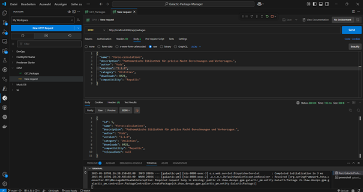
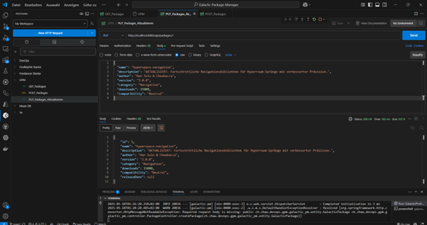

# Galactic Package Manager (GPM)

## Lernjournal: Implementierung einer Full-Stack DevOps-Anwendung

Dieses Lernjournal dokumentiert die Entwicklung des Galactic Package Managers (GPM), einer Full-Stack-Anwendung mit Spring Boot Backend und JavaScript Frontend. Das Projekt simuliert einen fiktiven Paketmanager für Weltraumtechnologien im Star Wars-Universum - quasi npm/Gradle für die Galaxis.

## Inhaltsverzeichnis

1. [Projektübersicht](#projektübersicht)
2. [Technologiestack](#technologiestack)
3. [Projektstruktur einrichten](#projektstruktur-einrichten)
4. [Backend implementieren](#backend-implementieren)
5. [Frontend entwickeln](#frontend-entwickeln)
6. [Integration und Tests](#integration-und-tests)
7. [Erweiterungsmöglichkeiten](#erweiterungsmöglichkeiten)

## Projektübersicht

Der Galactic Package Manager (GPM) ermöglicht Benutzern:
- Durchsuchen verfügbarer galaktischer Technologie-Pakete
- Anzeigen von Paketdetails und Bewertungen
- "Installation" von Paketen durch ein unterhaltsames Mini-Game
- Kompatibilitätsprüfung mit verschiedenen galaktischen Fraktionen

## Technologiestack

**Backend:**
- Spring Boot 3.x
- Java 21
- Gradle
- In-Memory Datenbank (für einfache Demonstration)

**Frontend:**
- HTML, CSS, JavaScript
- particles.js (für animierten Sternenhintergrund)
- chart.js (für Visualisierungen)
- anime.js (für Animationseffekte)

## Projektstruktur einrichten

### Schritt 1: Repository initialisieren

Dies wurde in Github manuell durchgeführt. 

### Schritt 2: Gradle-Projekt mit Spring Boot initialisieren

Es wurde Ctrl+Shift+P: "Spring Initializr: Create a Gradle Project...")
- Springboot-Version: 3.3.11
-java
- ch.zhaw.devops.gpm
- Artefakt ID: galactic-pm
- Jar
- Java Version 21

### Schritt 2: Gradle-Projekt mit Spring Boot initialisieren

Für die Erstellung des Spring Boot-Projekts wurde Visual Studio Code mit der Spring Boot Extension genutzt. Durch Drücken von `Ctrl+Shift+P` und Auswahl von "Spring Initializr: Create a Gradle Project..." öffnet sich der Projekt-Wizard, in dem folgende Parameter konfiguriert wurden:

- **Spring Boot Version:** 3.3.11 
- **Programmiersprache:** Java
- **Group ID:** ch.zhaw.devops.gpm (eindeutige Paket-Identifier im Maven-Format)
- **Artifact ID:** galactic-pm (Name des Projekts/der kompilierten Anwendung)
- **Packaging Type:** JAR (ausführbare Java-Anwendung)
- **Abhängigkeiten:** Spring Web (REST-API-Unterstützung)

Nach Bestätigung dieser Einstellungen (und der Auswahl des Backend-Ordners) generiert Spring Initializr automatisch die Grundstruktur des Projekts inklusive der erforderlichen Gradle-Konfiguration und Verzeichnisstruktur. Die resultierende `build.gradle`-Datei enthält bereits alle notwendigen Abhängigkeiten und Plugins für die Entwicklung der Galactic Package Manager-Backend-Komponente.

### Schritt 3: Projektstruktur für Monorepo einrichten

 Frontend-Teil einrichten:

1. In das `frontend`-Verzeichnis wechseln:
   ```bash
   cd frontend
   ```

2. Ein npm-Projekt initialisieren:
   ```bash
   npm init -y
   ```

3. Die benötigten Abhängigkeiten installieren:
   ```bash
   npm install particles.js chart.js animejs --save
   ```

4. Unterordner für CSS und JavaScript erstellen:
   ```bash
   mkdir css; mkdir js
   ```

5. Erste index.html-Datei im frontend-Verzeichnis erstellen

Vorest bleibt sie leer.

### Schritt 4: .gitignore erstellen


```
# Java/Gradle
.gradle/
build/
!gradle/wrapper/gradle-wrapper.jar
!gradle/wrapper/gradle-wrapper.properties
*.class
bin/
out/

# Node.js
node_modules/
npm-debug.log*
package-lock.json

# IDE
.idea/
.vscode/
*.iml
.classpath
.project
.settings/

# Logs
logs/
*.log

# Temp files
.DS_Store
Thumbs.db
```

---

## Backend implementieren

### Schritt 1: Datenmodell erstellen
Das Datenmodell `GalacticPackage.java` definiert die grundlegende Datenstruktur des Galactic Package Managers mit Feldern wie Name, Beschreibung, Autor, Version und Kompatibilität. Mit der `@Entity`-Annotation wird die Klasse als JPA-Entity markiert, was die automatische Persistierung in der Datenbank ermöglicht, während `@Id` und `@GeneratedValue` die Primärschlüsselverwaltung übernehmen.

### Schritt 2: Repository-Interface erstellen
Das Interface `PackageRepository.java` erweitert `JpaRepository` und ermöglicht dadurch den Datenbankzugriff mit vorgefertigten CRUD-Operationen ohne eigene SQL-Implementierungen. Zusätzlich wurden spezifische Suchmethoden wie `findByNameContainingIgnoreCase()`, `findByCompatibility()` und `findByCategory()` deklariert, welche Spring Data JPA automatisch in entsprechende SQL-Abfragen übersetzt.

### Schritt 3: REST-Controller implementieren
Der `PackageController.java` bildet das "Herzstück" (wie jeder Controller) der API und stellt mit entsprechenden `@RequestMapping`-Annotationen die REST-Endpunkte für Frontend-Anfragen bereit. Über Methoden wie `getAllPackages()`, `getPackageById()`, `searchPackages()` und weitere CRUD-Operationen wird die komplette Kommunikation zwischen Frontend und Backend ermöglicht, wobei die `@CrossOrigin`-Annotation den Zugriff von verschiedenen Domains erlaubt.

### Schritt 4: Demo-Daten für Testbetrieb erstellen
Die `DataInitializer.java`-Klasse ist mit `@Component` annotiert und implementiert `CommandLineRunner`, wodurch sie beim Anwendungsstart automatisch ausgeführt wird. Sie befüllt die Datenbank mit fiktiven Star Wars-Packages wie "hyperspace-navigation" und "imperial-scanner", um die Funktionalität ohne manuelles Anlegen von Testdaten demonstrieren zu können.

### Schritt 5: Spring Boot-Anwendung starten
```bash
./gradlew bootRun
```

Beim Start der Anwendung auf http://localhost:8080 erscheint zunächst der klassische Whitelabel Error - aber dies ist ein gewollter Fehler, denn er zeigt an, dass der Server läuft und auf API-Anfragen wartet. Um tatsächliche Daten zu sehen, muss nun entweder ein API-Client wie Postman verwendet werden (z.B. GET auf `/api/packages`) oder das Frontend implementiert werden, das diese Endpunkte anspricht.


### 6: Testen der API mit Postman

Bevor wir mit der Frontend-Entwicklung beginnen, soll nun dennoch die Backend-API auf korrekte Funktionalität geprüft werden. Postman bietet hierfür eine ideale Testumgebung, da es die direkte Interaktion mit den API-Endpunkten ohne Frontend-Code ermöglicht. Die drei grundlegenden HTTP-Methoden wurden erfolgreich getestet:

- **GET**: Abrufen aller Pakete und Überprüfung, ob die Demo-Daten korrekt initialisiert wurden


- **POST**: Erstellen eines neuen "force-calculations"-Pakets und Verifizierung der automatischen ID-Generierung



- **PUT**: Aktualisierung eines bestehenden Pakets mit verbesserten Eigenschaften, was die vollständige Datenpersistenz bestätigt
  


Diese API-Tests bilden nun das Fundament für die Frontend-Entwicklung, da sie sicherstellen, dass die Datenmanipulation wie erwartet funktioniert. Das "Whitelabel Error"-Problem soll nun bald behoben werden..

---

## Frontend entwickeln

### Schritt 1: Frontend-Verzeichnis einrichten

wurde oben schon erleidgt

### Schritt 2: HTML-Grundstruktur erstellen
Frontend in index.htlm erstellen

### Schritt 3: CSS für stilvolle Galaxis-Oberfläche

css -style.css erstellen

### Schritt 4: JavaScript-Dateien für Frontend-Logik erstellen

1. Particles.js Konfiguration:

frontend/js/particles-config.js


2. API Service für Backend-Kommunikation:

```javascript
// frontend/js/api-service.js
class ApiService {
  
```

3. Package Renderer für UI-Updates:

```javascript
// frontend/js/package-renderer.js
class PackageRenderer {
    constructor(apiService) {
        this.apiService = apiService;
        this.packagesListElement = document.getElementById('packages-list');
        this.packageDetailsElement = document.getElementById('package-details');
        this.installationGameElement = document.getElementById('installation-game');
        this.installationSuccessElement = document.getElementById('installation-success');
        
        // Package Details-Elemente
        this.packageNameElement = document.getElementById('package-name');
        this.packageAuthorElement = document.getElementById('package-author');
        this.packageVersionElement = document.getElementById('package-version');
        this.packageCategoryElement = document.getElementById('package-category');
        this.packageCompatibilityElement = document.getElementById('package-compatibility');
        this.packageDownloadsElement = document.getElementById('package-downloads');
        this.packageDescriptionElement = document.getElementById('package-description');
        
        // Button-Event-Listener
        document.getElementById('back-to-list').addEventListener('click', () => this.showPackagesList());
        document.getElementById('install-package').addEventListener('click', () => this.startInstallation());
        document.getElementById('cancel-installation').addEventListener('click', () => this.cancelInstallation());
        document.getElementById('return-to-details').addEventListener('click', () => {
            this.installationSuccessElement.classList.add('hidden');
            this.packageDetailsElement.classList.remove('hidden');
        });
        
        // Filter-Event-Listener
        document.getElementById('compatibility-filter').addEventListener('change', (e) => {
            this.filterByCompatibility(e.target.value);
        });
        
        // Search-Event-Listener
        document.getElementById('search-button').addEventListener('click', () => {
            const query = document.getElementById('search-input').value;
            this.searchPackages(query);
        });
        
        document.getElementById('search-input').addEventListener('keyup', (e) => {
            if (e.key === 'Enter') {
                const query = e.target.value;
                this.searchPackages(query);
            }
        });
    }
    
    async loadPackages() {
        const packages = await this.apiService.getAllPackages();
        this.renderPackagesList(packages);
    }
    
    renderPackagesList(packages) {
        this.packagesListElement.innerHTML = '';
        
        if (packages.length === 0) {
            this.packagesListElement.innerHTML = '<p class="no-results">No packages found. Try a different search.</p>';
            return;
        }
        
        packages.forEach(pkg => {
            const packageCard = document.createElement('div');
            packageCard.className = 'package-card';
            packageCard.dataset.id = pkg.id;
            
            packageCard.innerHTML = `
                <h3>${pkg.name}</h3>
                <p>${pkg.description.substring(0, 80)}${pkg.description.length > 80 ? '...' : ''}</p>
                <p><strong>Author:</strong> ${pkg.author}</p>
                <p><strong>Version:</strong> ${pkg.version}</p>
                <span class="compatibility ${pkg.compatibility}">${pkg.compatibility}</span>
            `;
            
            packageCard.addEventListener('click', () => this.showPackageDetails(pkg.id));
            this.packagesListElement.appendChild(packageCard);
        });
    }
    
    async showPackageDetails(id) {
        const pkg = await this.apiService.getPackageById(id);
        if (!pkg) return;
        
        this.packageNameElement.textContent = pkg.name;
        this.packageAuthorElement.textContent = pkg.author;
        this.packageVersionElement.textContent = pkg.version;
        this.packageCategoryElement.textContent = pkg.category;
        this.packageCompatibilityElement.textContent = pkg.compatibility;
        this.packageDownloadsElement.textContent = pkg.downloads.toLocaleString();
        this.packageDescriptionElement.textContent = pkg.description;
        
        // Animation mit anime.js
        this.packagesListElement.parentElement.classList.add('hidden');
        this.packageDetailsElement.classList.remove('hidden');
        
        anime({
            targets: this.packageDetailsElement,
            opacity: [0, 1],
            translateY: [20, 0],
            easing: 'easeOutExpo',
            duration: 800
        });
        
        // Speichere aktuelle Paket-ID für die Installation
        this.currentPackageId = id;
    }
    
    showPackagesList() {
        this.packageDetailsElement.classList.add('hidden');
        this.packagesListElement.parentElement.classList.remove('hidden');
        
        anime({
            targets: this.packagesListElement.parentElement,
            opacity: [0, 1],
            translateY: [20, 0],
            easing: 'easeOutExpo',
            duration: 800
        });
    }
    
    startInstallation() {
        this.packageDetailsElement.classList.add('hidden');
        this.installationGameElement.classList.remove('hidden');
        
        // Starte das Minispiel
        if (window.installationGame) {
            window.installationGame.startGame();
        }
    }
    
    cancelInstallation() {
        if (window.installationGame) {
            window.installationGame.stopGame();
        }
        
        this.installationGameElement.classList.add('hidden');
        this.packageDetailsElement.classList.remove('hidden');
    }
    
    showInstallationSuccess(packageData) {
        this.installationGameElement.classList.add('hidden');
        this.installationSuccessElement.classList.remove('hidden');
        
        // Chart.js für die Paketstatistik
        const ctx = document.getElementById('stats-chart').getContext('2d');
        new Chart(ctx, {
            type: 'radar',
            data: {
                labels: ['Speed', 'Reliability', 'Security', 'Size', 'Compatibility'],
                datasets: [{
                    label: 'Package Stats',
                    data: [
                        Math.floor(Math.random() * 100),
                        Math.floor(Math.random() * 100),
                        Math.floor(Math.random() * 100),
                        Math.floor(Math.random() * 100),
                        Math.floor(Math.random() * 100)
                    ],
                    backgroundColor: 'rgba(76, 159, 56, 0.2)',
                    borderColor: 'rgba(76, 159, 56, 1)',
                    pointBackgroundColor: 'rgba(76, 159, 56, 1)',
                    pointHoverBackgroundColor: '#fff',
                    pointHoverBorderColor: 'rgba(76, 159, 56, 1)'
                }]
            },
            options: {
                scales: {
                    r: {
                        angleLines: {
                            color: 'rgba(255, 255, 255, 0.2)'
                        },
                        grid: {
                            color: 'rgba(255, 255, 255, 0.2)'
                        },
                        pointLabels: {
                            color: 'rgba(255, 255, 255, 0.8)'
                        },
                        ticks: {
                            color: 'rgba(255, 255, 255, 0.8)',
                            backdropColor: 'transparent'
                        }
                    }
                },
                plugins: {
                    legend: {
                        labels: {
                            color: 'rgba(255, 255, 255, 0.8)'
                        }
                    }
                }
            }
        });
    }
    
    async searchPackages(query) {
        if (!query.trim()) {
            // Wenn die Suche leer ist, lade alle Pakete
            await this.loadPackages();
            return;
        }
        
        const packages = await this.apiService.searchPackages(query);
        this.renderPackagesList(packages);
    }
    
    async filterByCompatibility(faction) {
        if (!faction) {
            // Wenn kein Filter ausgewählt ist, lade alle Pakete
            await this.loadPackages();
            return;
        }
        
        const packages = await this.apiService.getPackagesByCompatibility(faction);
        this.renderPackagesList(packages);
    }
}
```

4. Mini-Spiel für die Paket-Installation:

```javascript
// frontend/js/installation-game.js
class InstallationGame {
    constructor(packageRenderer) {
        this.packageRenderer = packageRenderer;
        this.gameArea = document.getElementById('game-area');
        this.progressBar = document.getElementById('installation-progress');
        this.progressPercentage = document.getElementById('progress-percentage');
        this.progress = 0;
        this.targetCount = 0;
        this.clickedTargets = 0;
        this.gameInterval = null;
        this.targets = [];
    }
    
    startGame() {
        this.progress = 0;
        this.targetCount = 0;
        this.clickedTargets = 0;
        this.targets = [];
        this.updateProgress(0);
        
        // Lösche alle vorhandenen Ziele
        while (this.gameArea.firstChild) {
            this.gameArea.removeChild(this.gameArea.firstChild);
        }
        
        // Starte das Spiel
        this.gameInterval = setInterval(() => this.gameLoop(), 1000);
    }
    
    stopGame() {
        if (this.gameInterval) {
            clearInterval(this.gameInterval);
            this.gameInterval = null;
        }
        
        // Lösche alle vorhandenen Ziele
        this.targets.forEach(target => {
            if (target.element && target.element.parentNode) {
                target.element.parentNode.removeChild(target.element);
            }
        });
        this.targets = [];
    }
    
    gameLoop() {
        // Spawn neues Ziel
        this.spawnTarget();
        
        // Erhöhe die Installationsgeschwindigkeit mit der Zeit
        this.progress += 2;
        
        // Beende das Spiel, wenn die Installation abgeschlossen ist
        if (this.progress >= 100) {
            this.completeInstallation();
        }
        
        this.updateProgress(this.progress);
    }
    
    spawnTarget() {
        const target = document.createElement('div');
        target.className = 'target';
        
        // Zufällige Position im Spielbereich
        const maxX = this.gameArea.clientWidth - 40;
        const maxY = this.gameArea.clientHeight - 40;
        const posX = Math.floor(Math.random() * maxX);
        const posY = Math.floor(Math.random() * maxY);
        
        target.style.left = `${posX}px`;
        target.style.top = `${posY}px`;
        
        // Animation mit anime.js
        target.style.opacity = '0';
        this.gameArea.appendChild(target);
        
        anime({
            targets: target,
            opacity: [0, 1],
            scale: [0.5, 1],
            duration: 500,
            easing: 'easeOutElastic(1, .8)'
        });
        
        // Klick-Event
        target.addEventListener('click', () => this.targetClicked(target));
        
        // Timer für Verschwinden
        const targetObj = {
            element: target,
            timeout: setTimeout(() => {
                if (target.parentNode) {
                    anime({
                        targets: target,
                        opacity: 0,
                        scale: 0.5,
                        duration: 500,
                        easing: 'easeInExpo',
                        complete: () => {
                            if (target.parentNode) {
                                target.parentNode.removeChild(target);
                            }
                            this.targets = this.targets.filter(t => t.element !== target);
                        }
                    });
                }
            }, 3000)
        };
        
        this.targets.push(targetObj);
        this.targetCount++;
    }
    
    targetClicked(target) {
        if (target.clicked) return;
        target.clicked = true;
        
        // Animation beim Klicken
        anime({
            targets: target,
            opacity: 0,
            scale: 1.5,
            rotate: '1turn',
            duration: 500,
            easing: 'easeOutExpo',
            complete: () => {
                if (target.parentNode) {
                    target.parentNode.removeChild(target);
                }
                this.targets = this.targets.filter(t => t.element !== target);
            }
        });
        
        // Boost für den Installationsfortschritt
        this.progress += 5;
        this.clickedTargets++;
        this.updateProgress(this.progress);
        
        // Beende das Spiel, wenn die Installation abgeschlossen ist
        if (this.progress >= 100) {
            this.completeInstallation();
        }
    }
    
    updateProgress(value) {
        // Begrenze den Wert auf maximal 100
        value = Math.min(value, 100);
        this.progressBar.style.width = `${value}%`;
        this.progressPercentage.textContent = Math.floor(value);
    }
    
    completeInstallation() {
        this.stopGame();
        
        // Zeige Erfolgsseite mit Paketinformationen an
        this.packageRenderer.showInstallationSuccess({
            clickedTargets: this.clickedTargets,
            totalTargets: this.targetCount
        });
    }
}
```

5. Hauptdatei zum Initialisieren aller Komponenten:

```javascript
// frontend/js/main.js
document.addEventListener('DOMContentLoaded', () => {
    // API-Service initialisieren
    const apiService = new ApiService();
    
    // Package-Renderer initialisieren
    const packageRenderer = new PackageRenderer(apiService);
    
    // Installationsspiel initialisieren
    window.installationGame = new InstallationGame(packageRenderer);
    
    // Pakete laden
    packageRenderer.loadPackages();
    
    // Willkommensanimation mit anime.js
    anime({
        targets: '.logo-container',
        translateY: ['-30px', '0px'],
        opacity: [0, 1],
        easing: 'easeOutExpo',
        duration: 1500,
        delay: 500
    });
    
    anime({
        targets: '.search-container, .filter-container',
        translateY: ['20px', '0px'],
        opacity: [0, 1],
        easing: 'easeOutExpo',
        duration: 1200,
        delay: anime.stagger(200, {start: 1000})
    });
    
    anime({
        targets: '.packages-container',
        translateY: ['50px', '0px'],
        opacity: [0, 1],
        easing: 'easeOutExpo',
        duration: 1800,
        delay: 1500
    });
});
```

### Schritt 5: Frontend starten

Da das Frontend einfach statische Dateien enthält, können wir es einfach mit einem lokalen Server starten:

```bash
cd frontend
npx serve
```

Die Anwendung sollte nun unter http://localhost:3000 verfügbar sein.

## Integration und Tests

### Beide Komponenten starten

Um die vollständige Anwendung zu testen, müssen sowohl Backend als auch Frontend gestartet werden:

1. Backend starten (im Hauptverzeichnis):
```bash
./gradlew bootRun
```

2. Frontend starten (im frontend-Verzeichnis):
```bash
cd frontend
npx serve
```

Nun sollte die Anwendung funktionieren:
- Backend läuft auf http://localhost:8080
- Frontend läuft auf http://localhost:3000
- REST-API ist unter http://localhost:8080/api/packages erreichbar
- Frontend kommuniziert mit dem Backend und zeigt die galaktischen Pakete an

### Manuelles Testen der Hauptfunktionen

1. **Pakete anzeigen:** Die Liste aller Pakete sollte beim Öffnen der Seite geladen werden
2. **Paketdetails:** Beim Klicken auf ein Paket sollten die Details angezeigt werden
3. **Suchfunktion:** Die Suchleiste sollte funktionieren und die Ergebnisse filtern
4. **Kompatibilitätsfilter:** Das Dropdown-Menü sollte Pakete nach Fraktion filtern
5. **Installation mit Mini-Spiel:** Das Klick-Spiel sollte funktionieren und zur Erfolgsseite führen

## Erweiterungsmöglichkeiten

Dieses Basis-Projekt kann weiter ausgebaut werden, um DevOps-Praktiken zu vertiefen:

1. **Unit-Tests hinzufügen**
   - Backend-Tests mit JUnit für Controller und Repositories
   - Frontend-Tests mit Jest

2. **Docker-Container erstellen**
   - Dockerfile für Backend
   - Dockerfile für Frontend
   - Docker Compose für die Orchestrierung

3. **CI/CD mit Jenkins einrichten**
   - Build-Pipeline erstellen
   - Automatische Tests integrieren
   - Deployment-Automatisierung

4. **Weitere Backend-Features**
   - Benutzerauthentifizierung
   - Persistenz mit einer Datenbank (z.B. PostgreSQL)
   - Erweiterte Such- und Filterfunktionen

5. **Frontend-Verbesserungen**
   - Bewertungssystem für Pakete
   - Responsive Design optimieren
   - Fortgeschrittenere Visualisierungen

---

Mit diesem Projekt wurde eine funktionierende Full-Stack-Anwendung erstellt, die als Basis für weitere DevOps-Übungen dienen kann. Die Kombination aus Spring Boot und JavaScript-Bibliotheken bietet eine gute Lernumgebung, um die verschiedenen Aspekte des DevOps-Zyklus zu verstehen und zu implementieren.

**Möge der Quellcode mit dir sein!** 🌌
